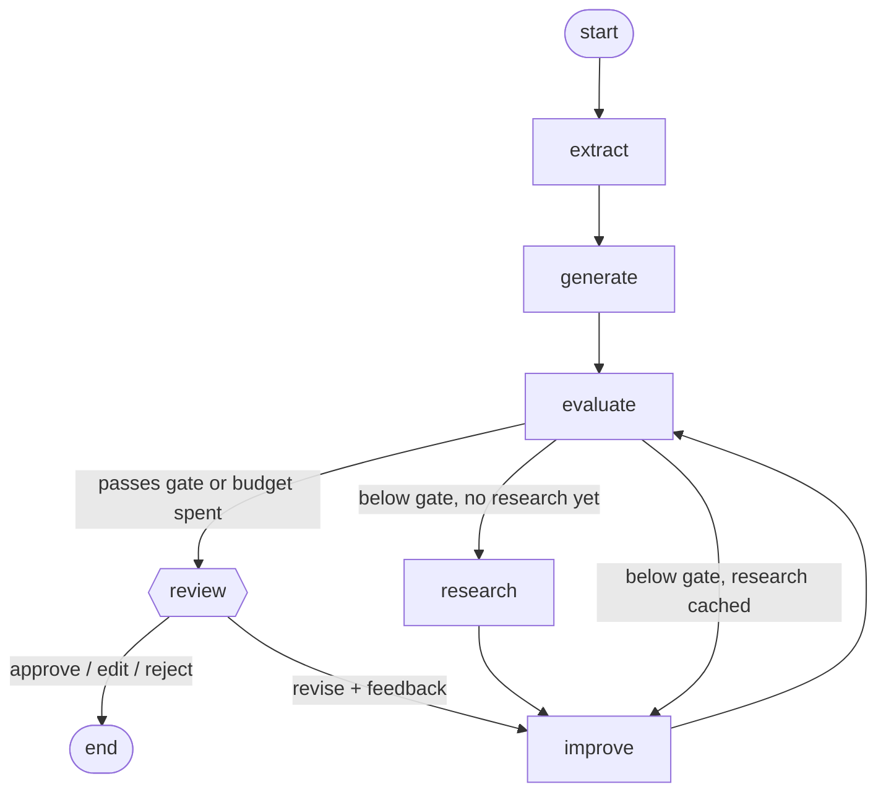

# PostPilot AI: Design

This document explains *why* the agent is shaped the way it is: the control flow, the
state model, the reliability decisions, and the trade-offs I would revisit at scale.

---

## 1. Problem

Turn a structured meeting summary into a LinkedIn post that is **engaging**, **faithful to
what was actually said**, and **approved by a human** before publication.

A single "write me a post" prompt fails in predictable ways: generic hooks, invented
metrics, drifting tone, and no way to tell a good draft from a bad one. The design goal is
a system that **measures its own output, improves it within a budget, and hands control to
a human at the right moment**.

## 2. Why an agent (and why LangGraph)

The workflow has a **loop with a data-dependent exit** (revise until good enough), a
**conditional side-trip** (research only when needed), and a **pause for external input**
(human review that may arrive minutes later, in a different request). That is a state
machine, not a chain.

LangGraph gives exactly those primitives: typed shared state, conditional edges,
`interrupt()` + checkpointers for pause/resume by `thread_id`, and first-class tracing.

## 3. Control flow



| Node | Model | Responsibility |
|---|---|---|
| `extract` | critic (T=0) | Raw meeting JSON → `ContentInsights` (title, topics, hooks…). Normalises arbitrary input into a stable schema. |
| `generate` | writer (T=0.7) | First draft from insights only. |
| `evaluate` | critic (T=0) | Rubric scores + strengths/weaknesses/suggestions. Updates best-so-far. |
| `research` | — | One Tavily search built from title + key topics. Cached in state. |
| `improve` | writer (T=0.7) | Revises using human feedback → critic weaknesses → research, in that priority. |
| `human_review` | — | `interrupt()` with the best draft and its critique; routes via `Command`. |
| `finalize` | — | Replaces `human_review` when `POSTPILOT_HUMAN_REVIEW=false`. |

`review` resolves to `human_review` or `finalize` at build time, so autonomous and
supervised modes share the same graph code.

## 4. State model

`GraphState` is a `TypedDict` grouped by purpose:

- **Input:** `meeting_data`
- **Working memory:** `insights`, `draft_post`, `evaluation`, `search_results`, `iteration`, `human_feedback`
- **Best-so-far:** `best_post`, `best_score`, `best_evaluation`
- **Output:** `final_post`, `status`
- **Audit trail:** `history`, an append-only list (`Annotated[..., operator.add]` reducer) of every evaluated draft and its score

Everything in state is JSON-serialisable (Pydantic outputs are stored via `model_dump()`),
so any checkpointer backend works and runs can be inspected or replayed.

## 5. Quality gate: why the score is computed in code

The critic returns five rubric scores (hook, clarity, engagement, originality,
**faithfulness**). The overall score is a **weighted mean computed in Python**
(`Evaluation.overall_score`), not requested from the model:

- LLMs are unreliable at arithmetic and tend to anchor an "overall" number independently of
  the sub-scores they just gave.
- Weights become an explicit, reviewable product decision (`config.SCORE_WEIGHTS`).
- The overall field is a `computed_field`, so it is excluded from the LLM-facing JSON
  schema (a test asserts this) but included when serialised to the API.

A post is accepted only if **all** of these hold:

```
overall ≥ SCORE_THRESHOLD (8.5)   AND   faithfulness ≥ MIN_FAITHFULNESS (7.0)   AND   len ≤ 3000
```

Faithfulness is a *hard floor*, not just a weighted term. An engaging post with invented
metrics must never pass on the strength of its hook. Scores are clamped to [0, 10] on
parse, so an out-of-range model output can't break the gate.

## 6. Grounding and hallucination control

Web research is useful for framing but is the main hallucination risk. Mitigations:

1. The critic sees the **source insights** alongside the post, so it can score faithfulness.
2. The improve prompt ranks sources: meeting insights are ground truth; research may only
   sharpen framing; new statistics or names are forbidden.
3. The faithfulness floor rejects drafts that slip anyway.

## 7. Reliability decisions

| Risk | Decision |
|---|---|
| Revisions make the post worse | Track `best_post`; the output is the best draft, not the last. (Covered by a test with scores 5 → 7 → 6 → 4.) |
| Infinite or expensive loops | Hard `MAX_ITERATIONS` budget; the budget-exhausted path still ends in human review. |
| Search provider outage | `research` catches, logs, and stores `[]`; routing treats `[]` as "already searched" so it never retries per round. |
| Redundant cost | Search once per run; the topic doesn't change between revisions. |
| Malformed LLM output | Structured output via Pydantic schemas; clamping validators on scores. |
| Slow or failing API calls | Per-request timeout and retries on both models. |
| Invalid human input | `ReviewDecision` validates the payload (`edit` needs text, `revise` needs feedback) before it reaches the graph; the API returns 422. |

## 8. Human-in-the-loop

`human_review` calls `interrupt(payload)`. The graph checkpoints and returns control to the
caller. The service layer detects the pause via `graph.get_state(config).interrupts` and
reports `status = "awaiting_review"`. Resuming is `graph.invoke(Command(resume=decision))` on
the same `thread_id`.

| Decision | Effect |
|---|---|
| `approve` | `final_post = best_post` → END |
| `edit` | `final_post = human text` → END |
| `reject` | END with no post |
| `revise` | Feedback stored in state, then routed back to `improve`. **Best-tracking resets** because the human has redefined "good", so the revised draft becomes the new baseline even if the critic scores it lower. The loop then continues and returns to review. |

Node code before `interrupt()` re-executes on resume, so `human_review` performs no side
effects before the interrupt.

## 9. Architecture layers

```
CLI ─┐
     ├─► PostPilotService (start / get / resume) ─► compiled graph ─► nodes ─► LLMs / search
API ─┘                ▲
Dashboard ── HTTP ────┘ (via API)
```

- **Dependency injection:** `build_graph(writer_llm, critic_llm, search_fn, settings, checkpointer)`.
  Production wiring lives in `build_default_graph`. Tests inject scripted fakes.
- **Service layer:** one place owns run lifecycle and status mapping, so the CLI, API, and
  dashboard behave identically.
- **Dashboard is a thin client:** all state, including paused runs, lives server-side,
  which is the only correct design once there is more than one browser tab.

## 10. Observability

LangSmith tracing is enabled purely by environment (`LANGSMITH_TRACING=true`). Each run is
tagged `postpilot` + model name, named `postpilot`, and carries metadata (thread id, app
version, thresholds, review mode), so traces can be filtered by configuration when
comparing prompt or threshold changes. Application logs record each iteration's overall
and faithfulness scores.

## 11. Testing strategy

43 offline tests (~1s) at four levels:

- **Schemas:** clamping, weighted score, weights sum to 1, the computed score is not in the LLM schema, review payload validation.
- **Routing:** each branch, threshold boundary, faithfulness floor, character limit, cached-empty search.
- **Graph:** termination, best-not-last selection, single search, search failure, prompts contain the critique and source insights.
- **Human review and API:** every decision path, re-resume → 409, unknown run → 404, bad payload → 422, bearer auth.

`FakeLLM` implements `with_structured_output(schema)` and records every prompt it receives,
so tests assert on *what the model was told*, not just what came back.

## 12. Observed behaviour and trade-offs

In the sample run the score went 7.90 → 7.90 → 8.25 → 8.25 and the budget ran out just
below the 8.5 gate. The run shows three honest limitations:

- **Self-critique plateaus.** The same model family writing and judging converges quickly.
  A different critic model, or a critic calibrated against human ratings, would give a
  stronger signal.
- **Revisions tend to get longer.** Length is only a hard cap today. A conciseness rubric
  item, or a softer length penalty, would help.
- **An LLM judge is a proxy.** The human gate exists precisely because the rubric is not
  ground truth.

Other deliberate trade-offs:

- **`InMemorySaver`** keeps the demo dependency-free; paused runs are lost on restart and
  not shared across workers.
- **Synchronous API handlers** run in FastAPI's threadpool. That is simple and correct for
  a low-QPS tool; a queue plus background workers would be the next step.

## 13. Future work

1. `PostgresSaver` checkpointer, background job queue, and run polling or webhooks.
2. Offline eval dataset + LangSmith experiments; calibrate critic scores against human labels.
3. Plateau detection: stop when Δscore < ε for two rounds.
4. Critic from a different model family to reduce self-preference bias.
5. Log reviewer edits as preference data for prompt tuning.
6. Prompt versioning with the version attached to trace metadata.
