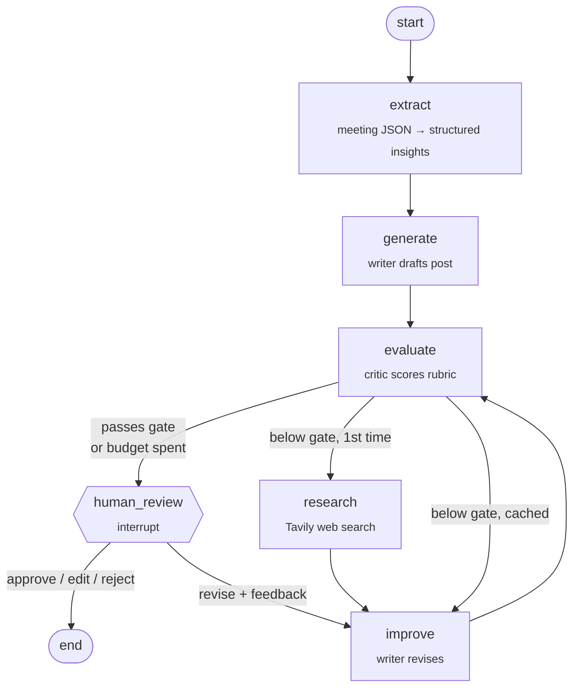
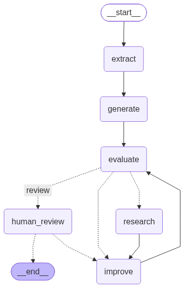

# PostPilot AI

### A self-critiquing, human-in-the-loop LinkedIn post agent built on LangGraph

[](https://github.com/Hadi2468/PostPilot-AI/actions/workflows/ci.yml)


PostPilot AI turns a structured meeting summary into a publish-ready LinkedIn post.
Instead of a single prompt, it runs a **Reflexion loop**: a writer drafts, a critic
scores the draft against a rubric, the agent researches the topic on the web, and the
writer revises until the post passes a quality gate. Then a **human approves, edits,
or sends it back** before anything is final.

---

## ✨ Highlights

| Capability | How |
|---|---|
| **Reflexion loop** | `generate → evaluate → research → improve → evaluate`, bounded by an iteration budget |
| **Deterministic quality gate** | LLM scores 5 rubric items; the overall score is computed **in code** (weighted mean) and gated on faithfulness and LinkedIn's 3,000-char limit |
| **Hallucination guard** | The critic scores *faithfulness* against the source insights; web research may sharpen framing but not add facts |
| **Best-of-N tracking** | A revision can make the post worse; the agent always returns the best-scoring draft, not the last one |
| **Human-in-the-loop** | LangGraph `interrupt()` + checkpointer pauses the run; resume with *approve / edit / revise / reject* |
| **Graceful degradation** | Web search runs once and is cached; if it fails, the agent continues without it |
| **Observability** | LangSmith tracing with run names, tags, and metadata (model, thresholds, thread id) |
| **Three interfaces, one service** | CLI, FastAPI (bearer-token auth), and a Streamlit dashboard share a single service layer |
| **Tested offline** | 43 pytest tests with injected fake LLMs: no API keys, no network, no cost; CI on every push |

---

## 🔀 Architecture



<details>
<summary>Rendered by LangGraph</summary>


</details>

See **[DESIGN.md](DESIGN.md)** for state design, routing logic, trade-offs, and future work.

---

## 🚀 Quickstart

```bash
git clone https://github.com/Hadi2468/PostPilot-AI.git
cd PostPilot-AI
python -m venv .venv && source .venv/bin/activate    # Windows: .venv\Scripts\activate
pip install -e ".[api,dashboard,dev]"
cp .env.example .env                                 # add OPENAI_API_KEY and TAVILY_API_KEY
```

### 1. CLI

```bash
postpilot --input data/sample_meeting.json                 # with human review prompt
postpilot --input data/sample_meeting.json --no-review     # fully autonomous
postpilot --input data/sample_meeting.json --output outputs/run.json --save-graph assets/graph.png
```

### 2. REST API

```bash
uvicorn postpilot.api:app --reload        # interactive docs at http://localhost:8000/docs
```

| Method | Endpoint | Purpose |
|---|---|---|
| `GET` | `/health` | Liveness check |
| `POST` | `/runs` | Start a run → returns `awaiting_review` with the best draft and critique |
| `GET` | `/runs/{thread_id}` | Inspect a run |
| `POST` | `/runs/{thread_id}/review` | Resume: `{"action": "approve" \| "edit" \| "revise" \| "reject", ...}` |

```bash
curl -X POST localhost:8000/runs/<thread_id>/review \
     -H "Content-Type: application/json" \
     -d '{"action": "revise", "feedback": "Lead with the p95 latency result"}'
```

Set `POSTPILOT_API_TOKEN` to require `Authorization: Bearer <token>`.

### 3. Streamlit dashboard

```bash
streamlit run dashboard/app.py            # talks to the API at POSTPILOT_API_URL
```

Upload a meeting JSON (or use the sample), watch the rubric scores and score-per-round chart,
then approve, edit in place, request a revision, or reject.

### 4. Docker

```bash
docker compose up --build                 # API on :8000, dashboard on :8501
```

---

## 📊 Sample run

Real output from `gpt-4o-mini` on the fictional [sample meeting](data/sample_meeting.json):

| Round | Overall | Notes |
|---|---|---|
| 0 | 7.90 | First draft; below the 8.5 gate → research + revise |
| 1 | 7.90 | Revised with critique + web context |
| 2 | **8.25** | Best draft (kept) |
| 3 | 8.25 | Budget spent → paused for human review → **approved** |

Final rubric: hook 8 · clarity 9 · engagement 8 · originality 7 · **faithfulness 9**.
The critic's remaining suggestion ("trim longer sentences, add a specific example") is
exactly what the human *revise* step is for.

<details>
<summary>Approved post (excerpt)</summary>

> What if your AI prototype could fall flat when faced with real-world challenges? In our
> latest AI Platform Guild meeting, we uncovered critical lessons while striving to transform
> our support-ticket triage agent from a promising prototype into a reliable production tool.
>
> …
>
> The key takeaway? Building AI solutions is about more than just the technology itself. It's
> about establishing a strong framework of evaluation, observability, and human oversight.
</details>

---

## 🧪 Testing

```bash
pytest          # 43 tests, ~1s, fully offline
ruff check .
```

LLMs and search are **dependency-injected**, so tests swap in scripted fakes and assert on
behavior: loop termination, best-draft selection, search caching and failure, the quality
gate, every human-review path, and the API contract (including auth, 404, 409, 422).

---

## 🗂️ Project structure

```
PostPilot-AI/
├── src/postpilot/
│   ├── config.py          # pydantic-settings; POSTPILOT_* env vars
│   ├── schemas.py         # structured LLM outputs + ReviewDecision contract
│   ├── prompts.py         # all prompt templates
│   ├── state.py           # GraphState (TypedDict)
│   ├── nodes.py           # extract / generate / evaluate / research / improve / human_review
│   ├── routing.py         # quality gate + conditional routing
│   ├── graph.py           # graph assembly with dependency injection + checkpointer
│   ├── llm.py             # writer (creative) and critic (deterministic) models
│   ├── tools/search.py    # Tavily adapter (swappable)
│   ├── observability.py   # LangSmith run config
│   ├── service.py         # run lifecycle: start / get / resume
│   ├── api.py             # FastAPI app
│   └── cli.py             # `postpilot` command
├── dashboard/app.py       # Streamlit UI (API client)
├── tests/                 # offline pytest suite
├── data/sample_meeting.json
├── Dockerfile · docker-compose.yml
└── .github/workflows/ci.yml
```

---

## ⚙️ Configuration

| Variable | Default | Purpose |
|---|---|---|
| `OPENAI_API_KEY` | — | Required |
| `TAVILY_API_KEY` | — | Required for web research (agent degrades gracefully without results) |
| `LANGSMITH_TRACING` / `LANGSMITH_API_KEY` | `false` | Optional tracing |
| `POSTPILOT_OPENAI_MODEL` | `gpt-4o-mini` | Model for writer and critic |
| `POSTPILOT_SCORE_THRESHOLD` | `8.5` | Overall score needed to stop revising |
| `POSTPILOT_MIN_FAITHFULNESS` | `7.0` | Hard floor on faithfulness |
| `POSTPILOT_MAX_ITERATIONS` | `3` | Revision budget |
| `POSTPILOT_HUMAN_REVIEW` | `true` | Pause for human approval |
| `POSTPILOT_API_TOKEN` | *(empty)* | Enables bearer auth on the API |

---

## 🛣️ Roadmap

- Durable checkpointer (Postgres) for multi-worker deployments
- Offline eval set + LangSmith experiments to calibrate the critic against human ratings
- Plateau detection: stop early when revisions stop improving the score
- Separate critic model family to reduce self-preference bias

## License

MIT
